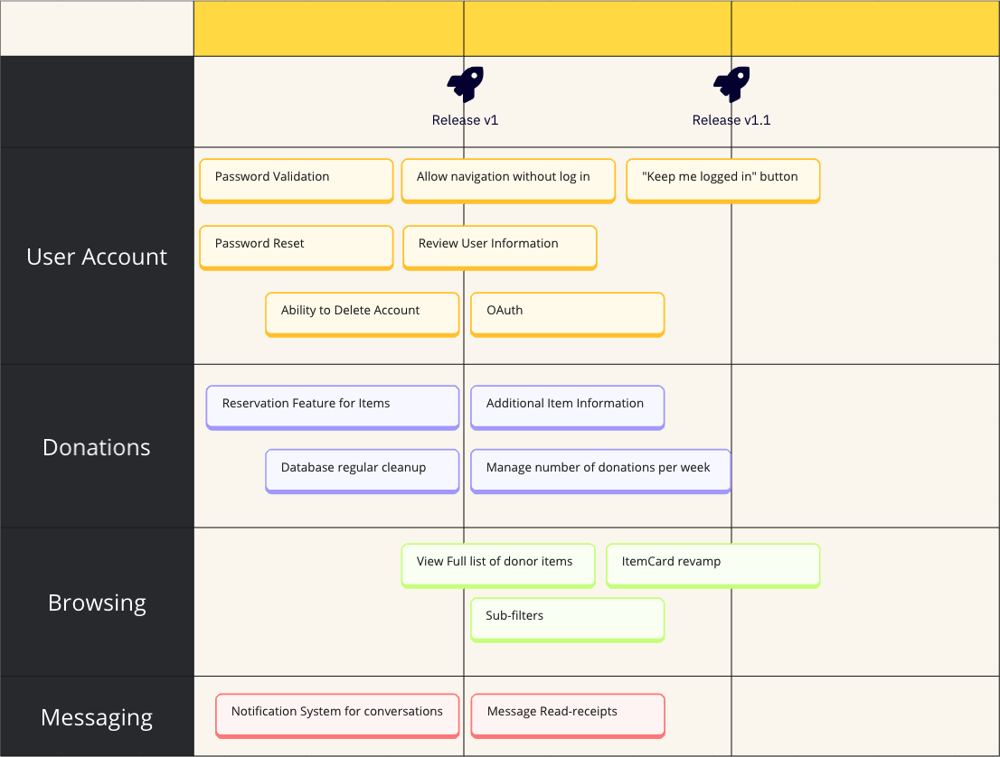

# Product Roadmap

The following is the planned Roadmap for the development of Kindly:  

All active Milestones in the Kindly project will follow this Roadmap and new feature suggestions will be considered for future releases.

We encourage new contributors to work on any aspect of the project that feels appropriate to their experience and interest but please always consider where an Issue falls within the roadmap.

If you submit a new Issue (whether it's a bug or new feature request) please indicate the most adequate Milestone based on the current Roadmap.

## User Stories
The following User Stories follow the projected Roadmap shown above.
When working on any Issue collaborators are encouraged to look for additional improvement opportunities that will fullfil these stories.
Similarly, new Issue submissions are always welcomed but may be prioritized for fulfillment if they conform to any of the stories below.

### User Account Milestone 🗝️
- As a User I want to have an option to reset my password from the login page
- As a User I want to be able to suspend my account
- As a User I want to be able to delete my account
- As a User I want to be able to browse through Kindly before I need to create an account in order to interact with Donations
- As a User I want to be able to sign up and login to Kindly with my login from social platforms such as Google or Facebook
- As a User I want to be able to keep my account logged in between visits to Kindly 

### Donations Milestone 🤝
- As a Donor I want to be able to mark any of my items as 'Reserved'
- As a Donor I want to prevent new Inquiries about any Items I have marked as 'Reserved'
- As a Refugee I want to receive confirmation what an Item has been reserved for me upon request
- As a Refugee I want to be able to view all details of an Item without having to navigate into a new page
- As a System Admin I want to guarantee that irrelevant data, such as Items that are no longer available, is removed from the database at periodic intervals
- As a Volunteer I want to guarantee that the availability of Donations is distributed through the community by limiting the number of donations that can be received in one week 

### Browsing Milestone 🔎
- As a Refugee I want to be able to easily consult the list of Items donated by a User specific user of the app
- As a Refugee I want to be able to filter all Items by different categories and categories so I can easily find the Items most relevant to my needs

### Messaging Milestone 📩
- As a User I want to receive notifications when there are updates to my conversations in Kindly

# Submitting a new Issue

Everyone is welcome to submit a new Issue to Kindly - whether you intend to resolve it yourself or would just like to raise the awareness of the community to it.

## Before you submit an Issue

Check the backlog for any duplicates - it's possible that someone has already submitted the same issue you've just spotted and having duplicates in the backlog can lead to confusion and a slowdown in development

## How to submit an Issue

Once you reach the **Issues** tab on the Kindly repo and create a new Issue you will be prompted with a template in the **New Issue Description** - please stick to this format and fill in as much detail as possible where prompted.

Include a clear example of the current behaviour with (as much as possible):

- A way to reproduce the problem
- Screenshots of the behaviour
- Information on any triage you've attempted

# Asking for Help

## Help with an Issue

If you have gotten stuck on an Issue you are contributing to and need technical help:

- Update the status of that Issue to `Blocked`. Other developers will be monitoring Issues with this status and prioritising them in their contributions.
- Add a comment to the Issue explaining the help you need

## Help with a question

The `Issues` tab is a working tool for the active development of Kindly, so it should be kept clear of communication not relating to development.

If you have a question or suggestion directly related to an open Issue please use the comments on that Issue ticket to discuss it with anyone working on it / the core team.

If you have a question related to Trafalgar Girls, Kindly or the community at large:

- Check the documentation first - there's a chance your question can be answered by reading the [README](../README.md) file
- Reach out on [Discord](https://discord.gg/Mrh5NYw52S)

# Contributing Code

Developers at all levels of experience and comfort in the Kindly tech stack are welcome to contribute!

However, before you set out to submit code, please review our [best practices](./BEST_PRACTICE.md) and our [installation guide](./BEFORE_YOUR_FIRST_ISSUE.md).

## Database Schema

Kindly uses a Postgres database served through [Supabase](https://supabase.com)

### Contributing changes to our database

Refer to the [official documentation](https://supabase.com/docs/guides/cli/managing-environments?queryGroups=environment&environment=staging#auto-schema-diff) on managing migrations for any contributions that require changes to the Supabase project.

## Finding an Issue

### As a newcomer

If it's your first time submitting code to Kindly and/or you are looking to get acquainted with any one part of our tech stack or code base, we recommending finding an Issue labeled `Good first issue`. You can filter for these.

### As a senior

If you've been contributing to Kindly for a while (Thanks! ✨) and are quite comfortable with the tech stack and code base:

- Check first for any Issues with the status `Blocked`
- If you have been given access along with the core team, help the development by reviewing any pending Pull Requests before starting a new Issue
- Check for any Issues labeled `High Priority`
- Consider pairing up with a less experienced developer dipping into a more complex issue - part of the ethos for Kindly is sharing knowledge

## Being Assigned an Issue

Once you've identified an Issue you'd like to contribute to please add a comment to its thread requesting to be assigned.

In that comment, add a brief outline of the approach you're hoping to take. This does not need to be a comprehensive report but it helps us promote knowledge sharing in the community and can help other contributors quickly identify any potential clashes with their code or it may outline a good opportunity to collaborate with someone.

The Kindly core team will respond to your comment as soon as possible and assign you to the Issue. You may want to tag one of the team members in your comment but allow a few days for someone to get back to you. (The backlog is reviewed by the Kindly core team every Friday)

To help us maintain the workflow of development please keep in mind these guidelines:

- **Always check if someone else has already been assigned or requested an issue.** If they have, please do not assign yourself (if you are a collaborator on the repo) or request the same issue unless you have agreed to work on it together 
  - Most tickets are not likely to need more than one developer but if you intend on collaborating then please let us know in a comment to that issue
- **If an Issue is flagged as `Stale` while you are assigned to it the core team may un-assign you and move the issue into the backlog.** Issues are marked as `stale` after a period of inactivity to help the core team monitor the workflow of the project
- **Only request (or assign yourself, if you are a collaborator in the repo) one issue at a time** unless you are implementing changes that affect two issues closely related. We try to keep issues in the backlog free, if they are not being addressed immediately, to allow new contributors to pick them up

## Finally

Have fun! 🎡
