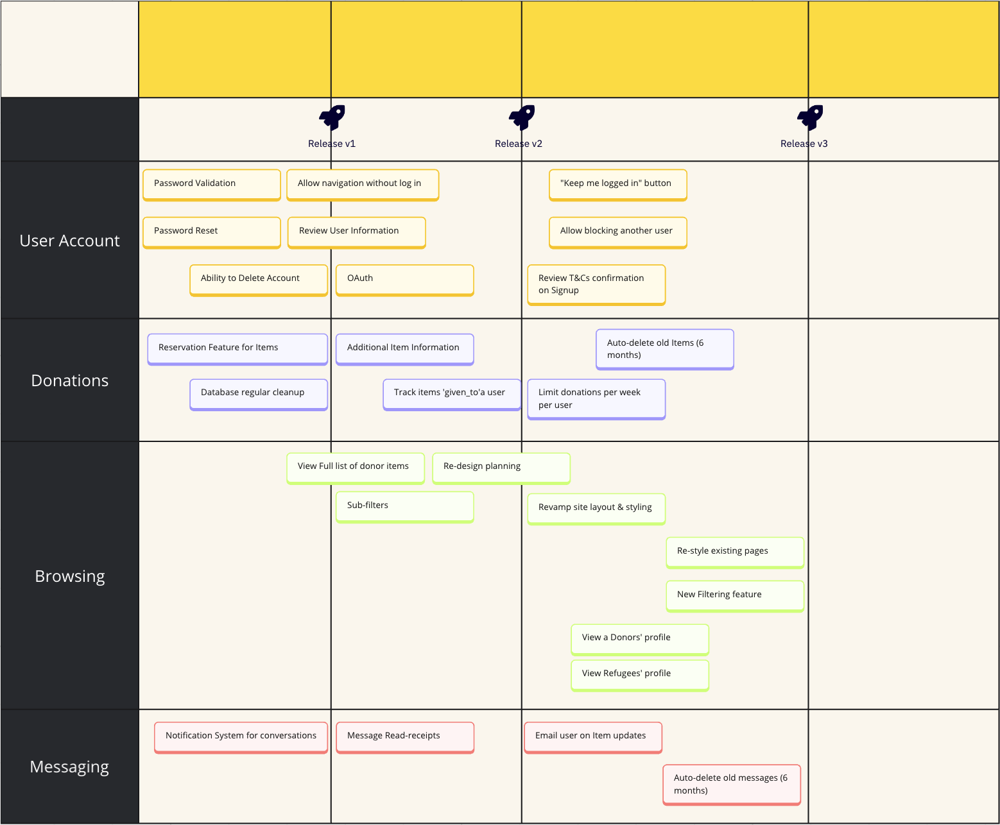

# Product Roadmap

The following is the planned Roadmap for the development of Kindly:  

All active Milestones in the Kindly project will follow this Roadmap and new feature suggestions will be considered for future releases. The project is currently on `Release v2` in this roadmap.

We encourage new contributors to work on any aspect of the project that feels appropriate to their experience and interest but please always consider where an Issue falls within the roadmap.

If you submit a new Issue (whether it's a bug or new feature request) please indicate the most adequate Milestone based on the current Roadmap.

## User Stories

The following User Stories follow the projected Roadmap shown above.
When working on any Issue collaborators are encouraged to look for additional improvement opportunities that will fullfil these stories.
Similarly, new Issue submissions are always welcomed but may be prioritized for fulfillment if they conform to any of the stories below.

### User Account Milestone 🗝️

- As a User I want to be able to block interactions with other accounts
- As a User I want to be able to keep my account logged in for when I return to the page in future
- As a User I want to be able to review Terms and Conditions of the platform

### Donations Milestone 🤝

- As a Refugee I want to be able to reach donors about items I need without fearing over-active users of the platform reserving a hight number of donations before I have a chance to request them
- As a User I want to know that all items I view on the platform are currently available without fear of spending my time trying to reach unavailable Donors to reserve 'stale' donations

### Browsing Milestone 🔎

- As a Refugee I want to be able to review the profile of Donors on the platform and easily find other items they are offering at any time

### Messaging Milestone 📩

- As a User I want to be able to receive updates about any updates on my donations/enquiries when I am not logged into my account
- As a User I want my `conversations` tab to be kept free of clutter by having old and inactive conversations disappear
