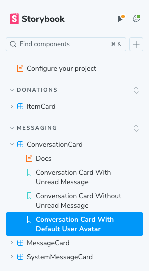
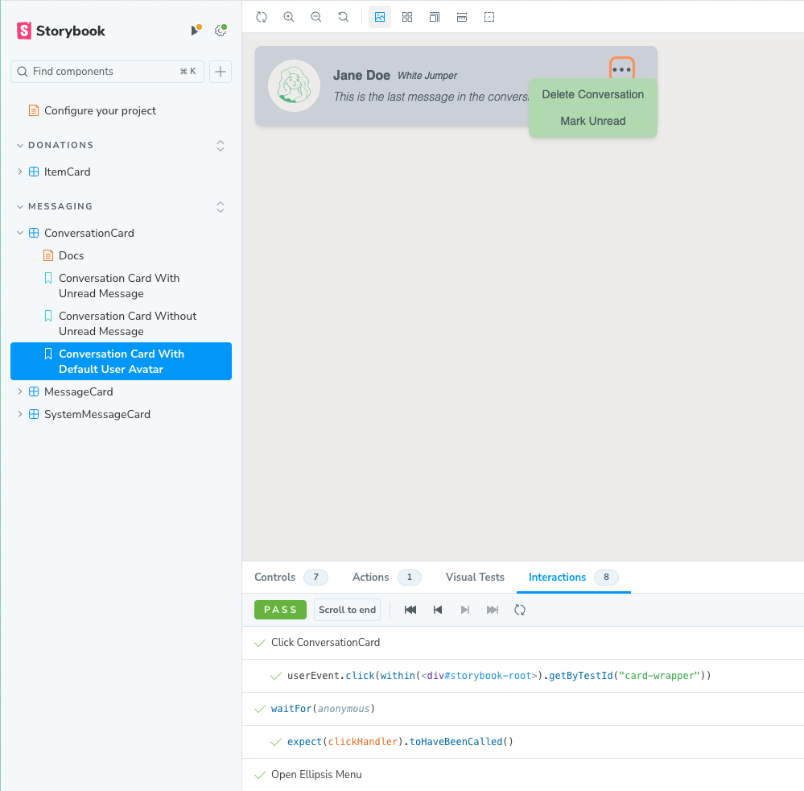

## Testing Expectations

All Pull Requests are expected to include sufficient testing.

- If a new component has been added, a unit test for that component should be created
- If a new feature has been implemented, the adequate integration or end-to-end test should consider it
- If no new tests are added, the Pull Request description should provide a brief note on why this was not necessary

All new and prior tests should be passing in every Pull Request

## Component Testing

We use [Storybook](https://storybook.js.org/tutorials/intro-to-storybook/react/en/get-started/) to test the rendering and basic functionality of our components as well as documenting them.

You can view our component library by running the following command:

```bash
npm run storybook
```

If you create a new component or refactor an existing component you should make the relevant changes to a `.stories.tsx` file inside the `stories/` folder.

### Component Library and documentation

In order to build the best possible Developer Experience keep the component library organized by feature, as shown in the example below:  


### Component interactions in Storybook

All component stories should include tests for any basic functionality provided by the component. All `interactions` tests should be passing in Storybook after any changes to our components.


